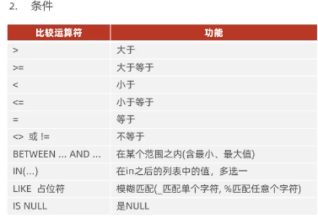
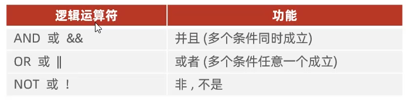
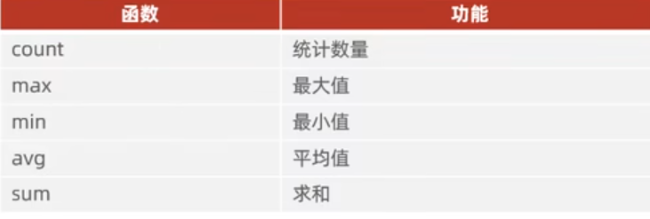

# DQL
语法
```
SELECT 字段列表
FEOM 表明列表
WHERE 条件列表
GROP BY 分组字段列表
HAVING 分组后条件列表
ORDER BY 排序字段列表
LIMIT 分页参数
```
- ## 基本查询
1. 查询多个字段
    ```sql
    SELECT 字段1,字段2,字段3...... FROM 表名；
    SELECT * FROM 表名；
    ```
2. 设置别名
    ```SQL
    SELECT 字段1[AS] 别名1，字段2[AS]别名2，字段3[AS]别名3...... FROM 表名；
    ```
3. 去除重复记录
    ```sql
    SELECT DISTINCT 字段列表 FROM 表名；
    ```

- ## 条件查询(WHERE)
 1. 语法
 ```sql
    SELECT 
 ```
 2. 条件
    <br><br>
    eg:
    ```sql
    ---查询年龄为18或20或24的
    SELECT * FROM [表名] where age IN(18,20,24);
    ---查询名字是两个字的
    SELECT* FROM [表名] where name LIKE'__'；
    ---查询身份证号是X结尾的
    SELECT *FROM [表名] WHERE idcard LIKE'%X';
    ```

- ## 聚合函数(count,max,min,avg,sum)
1. 聚合函数介绍：将一列数据作为一个整体，进行纵向计算
2. 常见聚合函数
3. 语法
    ```sql
    SELECT 聚合函数（字段列表） FROM 表名；
    ```
    **null值不参与所有的聚合函数运算**
    eg:
    ```sql
    --统计表的总数据量（行）
    SELECT count(*) FROM [表名];
    ---统计平均年龄
    SELECT avg(age) FROM [表名]；
    ---统计最大年龄
    SELECT max(age) FROM [表名]；
    ---统计长沙地区的学生的年龄之和
    SELECT sum(age) FROM [表名] WHERE address='长沙'；

    ```
- ## 分组查询(GROUP BY)
1. 语法：
```sql
SELECT 字段列表 FROM 表名[WHERE 条件] GROUP BY 分组字段名[HAVING 分组后过滤条件]；
```
2. where与having区别
    - 执行时机不同：where是分组之后进行过滤，不满足where条件，不参与分组<br>
    而having是分组之后对结果进行过滤。
    - 判断条件不同：where不能对聚合函数进行判断，而having可以。

eg:
```sql
---根据性别分组，统计男同学和女同学的数量
SELECT gender,count(*)FROM [表名]GROUP BY gender;
---根据性别分组，统计男同学和女同学的平均年龄
SELECT gender,avg(age)FROM [表名] GROUP BY gender
---查询年龄小于45的同学，并根据家庭地址分组，获取同学数量大于3的住址
SELECT address,count(*)address_count from [表名] WHERE age<45 GROUP BY address HAVING  address_count>=3;
```
⚠️
- where>聚合函数>having
- 分组之后，查询的字段一般为聚合函数和分组字段，查询其他字段无任何意义。
- ## 排序查询(ORDER BY)
1. 语法
```sql
SELECT 字段列表 FROM 表名 ORDER BY 字段1 排序方式1，字段2 排序方式2；
---多字段排序，当地一字段值相同时，才会根据第二字段进行排序。
```
2. 排序方式
- ASC:升序（默认）
- DESC:降序
eg:
```sql
---根据年龄对学校同学进行升序排序
SELECT *FROM [表名] ORDER BY age;
SELECT *FROM [表名] ORDER BY age ASC;
---根据年龄对学生进行升序排序，如果年龄相同，根据入学时间进行排序
SELECT *FROM [表名]ORDER BY age asc,time desc;
```
- ## 分页查询(LIMIT)
 1. 语法
 ```sql
 SELECT 字段列表 FROM 表名 LIMIT 起始索引,查询记录数；
 ```
**⚠️注意：**
- 起始索引从0开始，起始索引=（查询页码-1）*每页显示记录数。
- 分页查询是数据库的方言，MySQL里是LIMIT.
- 如果查询的是第一页数据，起始索引可以省略，直接简写为 limit (查询记录数)。
- LIMIT写在最后。