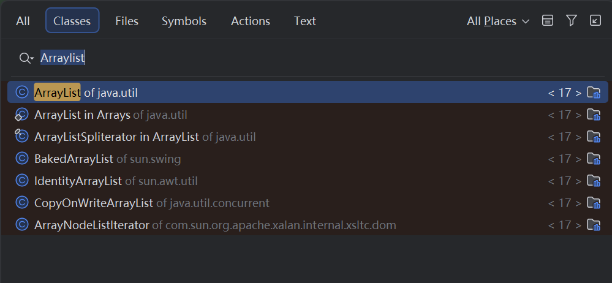
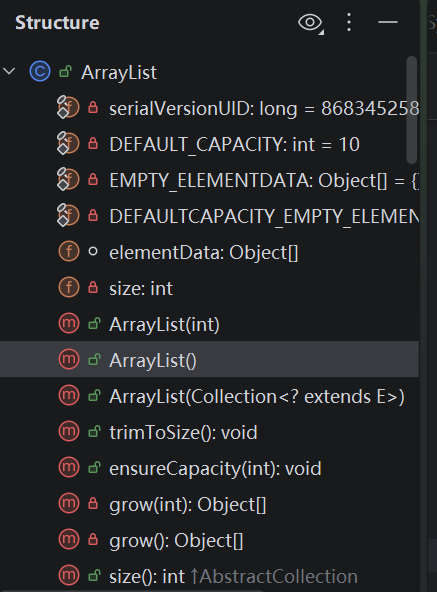
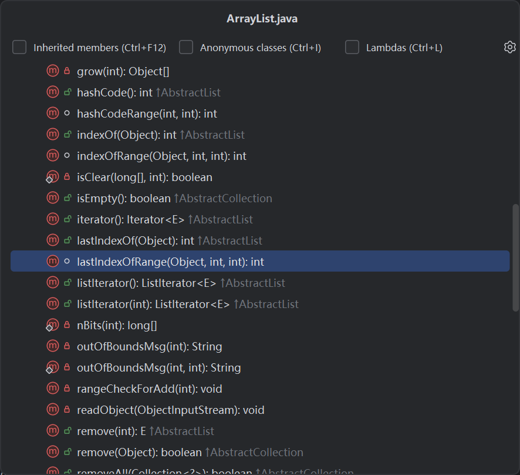
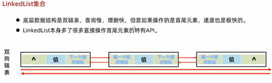

# 📖 ArrayList源码分析1

## 1. 环境准备与工具使用

### 1.1 IDE操作技巧
**快捷键：Ctrl + N**
- 用途：快速打开类
- 示例：输入"ArrayList"即可定位
- 截图：

### 1.2 源码查看工具
**大纲视图的两种方式：**

| 方法  | 快捷键 | 特点 | 截图 |
|---------|--------|------|------|
| 结构窗口 | Alt+7 | 常驻侧边栏 |  |
| 弹出窗口 | Ctrl+F12 | 快速查看查询 |  |

## 2. 源码分析

### 2.1 空参构造
```java
public ArrayList() {
        this.elementData = DEFAULTCAPACITY_EMPTY_ELEMENTDATA;
    }
```
ctrl+b 更近`DEFAULTCAPACITY_EMPTY_ELEMENTDATA;`
```java
 private static final Object[] DEFAULTCAPACITY_EMPTY_ELEMENTDATA = {};
```

⚠️**所以使用ArrayList的空参构造的时候建造的是空数组,并且默认size为0**
### 2.2 add方法
```java
public boolean add(E e) {
        modCount++;//集合变化的次数
        add(e, elementData, size);//要加的元素，底层的数组，数组当前大小（接下来要储存的位置索引）
        return true;
    }
```
跟进里面的add
```java
private void add(E e, Object[] elementData, int s) {
        if (s == elementData.length)//size不够，要扩容
            elementData = grow();
        elementData[s] = e;
        size = s + 1;
    }
```
再持续跟进
```java
 private Object[] grow() {
        return grow(size + 1);//先确定最小容量，即可以可以装下所有元素
    }
private Object[] grow(int minCapacity) {
        int oldCapacity = elementData.length;//原来容量
        if (oldCapacity > 0 || elementData != DEFAULTCAPACITY_EMPTY_ELEMENTDATA/*空，0*/) {
            int newCapacity = ArraysSupport.newLength(oldCapacity,
                    minCapacity - oldCapacity, /* 理论上我们最小要新增的容量 */
                    oldCapacity >> 1           /* 默认新增大小，右移一位，÷2（向下取整） */);
            return elementData = Arrays.copyOf(elementData, newCapacity/*根据这个参数，创建新的数组*/);//将底层数组拷贝到扩容后数组
        } else {
            return elementData = new Object[Math.max(DEFAULT_CAPACITY, minCapacity)];//第一次添加元素
        }
    }
public static int newLength(int oldLength/*老*/, int minGrowth/*最小要新增的*/, int prefGrowth/*默认的*/) {
        // preconditions not checked because of inlining
        // assert oldLength >= 0
        // assert minGrowth > 0

        int prefLength /*新数组真正的长度*/= oldLength + Math.max(minGrowth, prefGrowth); //由于可以添加很多元素，默认扩容可能不够
        if (0 < prefLength && prefLength <= SOFT_MAX_ARRAY_LENGTH) {
            return prefLength;
        } else {
            // put code cold in a separate method
            return hugeLength(oldLength, minGrowth);//如果一次性加入多个元素，则扩容到刚好放下所有元素的大小
        }
    }
```
### 2.3 Iterator构造器
回顾Iterator的使用
```java 
ArrayList<String>list=new ArratList<>();
Iterator<String> it=list.Iterator
whlie(it.hasNext()){
    String str=it.next()//"指针"（即构造器对象）往后移一位，并获取元素
    System.out.println(str   );
}
```
看源码
```java
public Iterator<E> iterator() {
        return new Itr();//创建一个迭代器对象 
    }

    /**
     * An optimized version of AbstractList.Itr
     * 创建一个Arraylist的内部类  
     */
    private class Itr implements Iterator<E> {
        
        int cursor;       // 光标，迭代器里指针,默认零索引
        int lastRet = -1; // 上一次操作的索引
        int expectedModCount = modCount;//记录创建迭代器的时候的集合变化的次数，add和remove会增加modCount

        // prevent creating a synthetic constructor
        Itr() {}
        //判断是否有元素
        public boolean hasNext() {
            return cursor != size;//只要不是指向最后一个索引后面，就返回true
        }

        @SuppressWarnings("unchecked")
        public E next() {
            checkForComodification();//检查集合变化次数
            /*
            final void checkForComodification() {
            if (modCount != expectedModCount)//集合现在的变化次数vs 创建对象时记录的变化次数
            //如果不一样，则说明再迭代器遍历过程中，使用了集合中的方法修改或删除了元素
                throw new ConcurrentModificationException();//并发修异常
        }*/
            int i = cursor;//记录当前指针指向的索引位置
            if (i >= size)
                throw new NoSuchElementException();//异常
            Object[] elementData = ArrayList.this.elementData;//获取底层数组地址
            if (i >= elementData.length)
                throw new ConcurrentModificationException();
            cursor = i + 1;//移动指针
            return (E) elementData[lastRet = i];//获取光标移动之前指向的元素
        }

        public void remove() {
            if (lastRet < 0)
                throw new IllegalStateException();
            checkForComodification();

            try {
                ArrayList.this.remove(lastRet);
                cursor = lastRet;
                lastRet = -1;
                expectedModCount = modCount;
            } catch (IndexOutOfBoundsException ex) {
                throw new ConcurrentModificationException();
            }
        }

        @Override
        public void forEachRemaining(Consumer<? super E> action) {
            Objects.requireNonNull(action);
            final int size = ArrayList.this.size;
            int i = cursor;
            if (i < size) {
                final Object[] es = elementData;
                if (i >= es.length)
                    throw new ConcurrentModificationException();
                for (; i < size && modCount == expectedModCount; i++)
                    action.accept(elementAt(es, i));
                // update once at end to reduce heap write traffic
                cursor = i;
                lastRet = i - 1;
                checkForComodification();
            }
        }

        final void checkForComodification() {
            if (modCount != expectedModCount)
                throw new ConcurrentModificationException();
        }
    }
```
** 所以在使用迭代器或者增强for遍历数组时，不要使用集合的方法增加或者删除元素**
# 📖LinkedList学习
**底层是双链表**<br>
## 2.源码分析
### 2.1 内部类 Node 结点
```java
private static class Node<E> {
        //三个值
        E item;//当前要储存的值
        Node<E> next;//前结点的地址
        Node<E> prev;//后结点的地址
        //有参构造
        Node(Node<E> prev, E element, Node<E> next) {
            this.item = element;
            this.next = next;
            this.prev = prev;
        }
    }
```
### 2.2 三个成员变量
```java
transient int size = 0;//结点数

    /**
     * Pointer to first node.
     */
    transient Node<E> first;//头结点

    /**
     * Pointer to last node.
     */
    transient Node<E> last;//尾结点
    
```
在构造后，会自动初始化成员变量，默认值
### 2.3 add方法
```java
public boolean add(E e) {
        linkLast(e);
        return true;
    }
void linkLast(E e) {
        final Node<E> l = last;//记录当前的尾结点地址
        final Node<E> newNode = new Node<>(l, e, null);//new一个新节点，如果是第一个节点，则前结点为空
        //否则，新结点连上原来的尾结点（原尾结点赋值给新尾结点的prev）
        last = newNode;//将 当前新节点作为新的尾结点
        if (l == null) //新增节点如果是第一次生成的
            first = newNode;//设置为头结点first
        else
            l.next = newNode;//将原来的尾结点连接上新节点（将新节点的地址赋值原来的尾结点的next）
        //至此完成双链表的双向
        size++;//节点数增加
        modCount++;
    }
```


