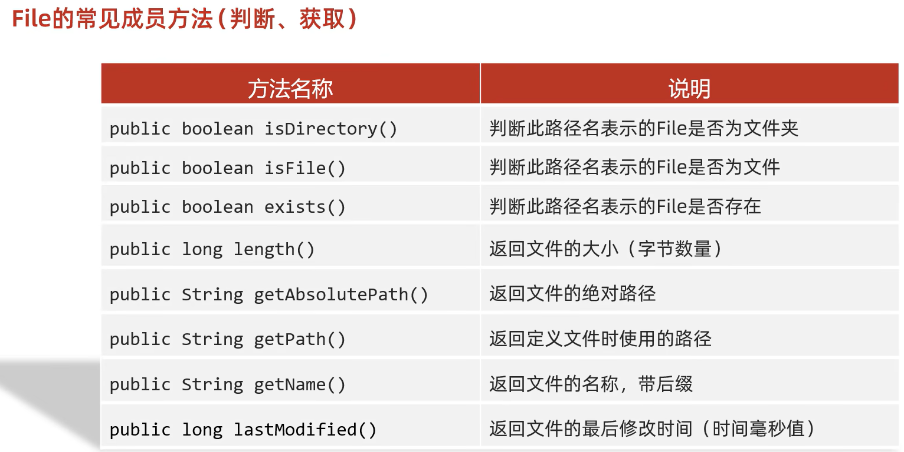
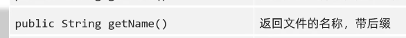
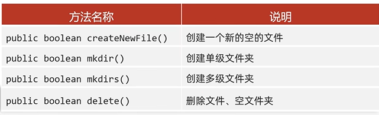
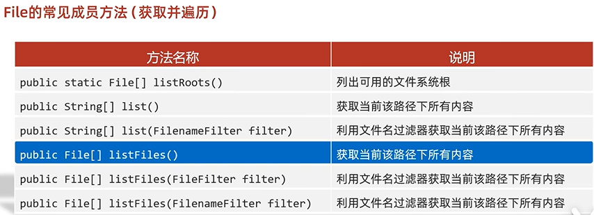
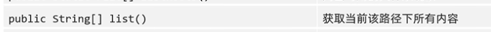
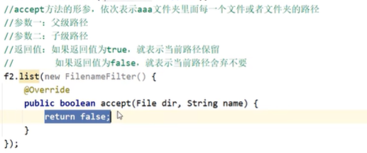
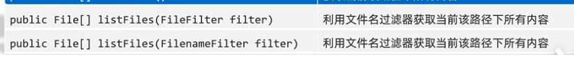

# File

## 常见方法

#### 1.判断获取



```java
/*public long length()*/
//要点一：这个方法只能获取文件的大小，单位是字节1Byte=8bit,
//如果单位想要是M,G,需要不断地/1024
//要点二：这个方法无法获取文件夹的大小
File f1=new File("D:\\aaa\\a.txt");//这是一个文件
long len=f1.length();
File f1=new File("D:\\aaa\\bbb");//这是一个文件夹
long len=f1.length();//输出不正常
    
```

```java
/*public String getAbsolutePath()*/
//返回文件的绝对路径
```

public String getPath();返回创建File时括号内传入的路径

：带后缀，扩展名，文件夹返回的时文件夹名字

#### 2.




：文件不存在，利用该方法创建。可以直接抛出Exception。若存在，返回false；父级路径不存在，会返回IO异常； 不加后缀，会创建一个没后缀的文件

：windows路径唯一，路径存在，则创建失败。只能创建单级文件夹

：也可以创建单级文件夹。底层调用了mkdir（)

：不走回收站。只能删除空的文件夹，有内容则删除失败



：隐藏的也返回。可以用增强for，以此表示文件夹内的每一个文件或者文件夹。

- 当调用这File表示的路径不存在时，返回null
- 当调用这File表示的路径是文件夹时，返回null
- 当调用这File表示的路径是一个空文件夹时，返回一个长度为0的数组
- 当调用这File表示的路径是一个有内容的文件夹时，将里面的所有文件和文件夹的路径都放在File数组中返回
- 当调用这File表示的路径是一个隐藏文件的文件夹时，将里面的所有文件和文件夹的路径放在File数组中返回，包含隐藏文件
- 当调用这File表示的路径是需要权限才能访问的文件夹时，返回null

:静态，遍历硬盘

：只获取名字

：FilenameFilter函数式接口，true保留。

：过滤器传输参数类型不同，前者是完整路径，后者是父子分开传。