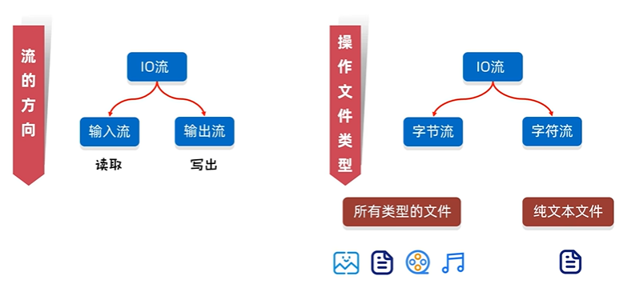
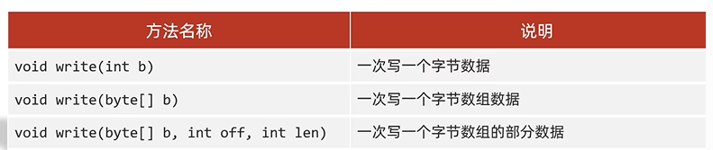
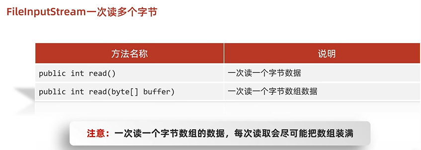
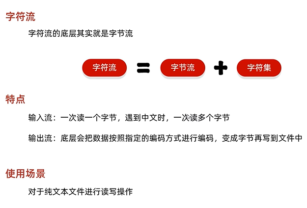
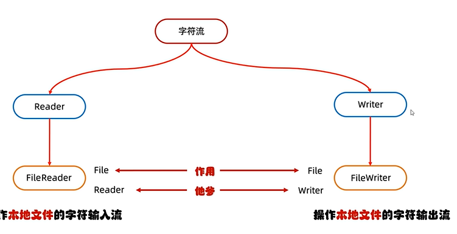
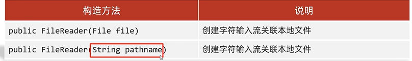
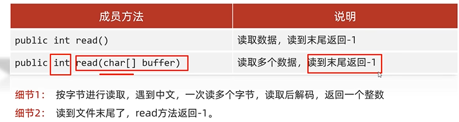
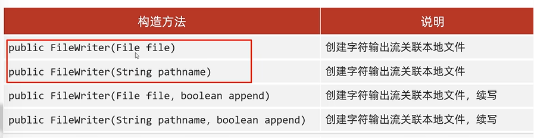

# IO流

用于读写文件中的数据

## IO的分类



纯文本文件：Windows自带的记事本打开能读懂（word,excel不能，只能用字节流）

## 字节流

### FileOutputStream

操作本地文件的字节输出流，可以把程序中的数据写到本地文件中.字节流的基本流

#### 书写步骤:

- 创建字节输出流对象
- 写数据
- 释放资源

```java
public class ByteStreamDemo1 {
    public static void main(String[] args) throws IOException {
        //1.创建对象
        //写出 输出流
        FileOutputStream fos=new FileOutputStream("MyIO\\a.txt");
        //写出数据
        fos.write(97);
        //3.释放资源
        fos.close();
    }
}
```

#### 原理细节

- 创建字符流对象

  细节1：参数是字符串表示的路径（底层还是new file）或者是File对象都可以

  细节2：如果文件不存在，会创建一个新空文件，但是父级目录要存在

  细节3：如果文件已经存在，则会清空文件

- 写数据

  细节：write方法的参数是整数，但是实际上写到本地上的是ASCII码对应的字符

- 释放资源

  每次使用完流，都要释放资源，接触资源占用

#### FileOutputStream写数据的3种方式



```java
public class ByteStreamDemo2 {
    public static void main(String[] args) throws IOException {
        //1.创建对象
        FileOutputStream fos=new FileOutputStream("MyIO\\a.txt");

    /*    //2.写出数据
        fos.write(97);//a
        fos.write(98);//b*/

        /*byte[] bytes={97,98,99,100};
        fos.write(bytes);*/
        //参数一：数组
        //参数二：起始索引
        //参数三：结束索引
        byte[] bytes={97,98,99,100};
        fos.write(bytes,0,2);//bc
        //3.释放资源
        fos.close();
    }
}
```

##### FileOutputStream写数据的几个小问题

**换行写：**换行符，window:\r\n

**续写：**传入第二个参数，true

```java
public static void main(String[] args) throws IOException {
    /*
    * 换行写：
    *       windows:   /r/n
    *       linux:     \n
    *       mac:       \r
    * 续写：创建对象的时候传入第二个参数。true，打开续写功能。默认是false
   
    * */
    //1.创建对象
    FileOutputStream fos=new FileOutputStream("MyIO\\a.txt",true);
    //2.写出数据
    //qxtshidameinv
    String str="qxtshidameinv";
    byte[] arr = str.getBytes();
    fos.write(arr);

    //换行
    //添加换行符
    String wrap="\r\n";
    byte[] bytes=wrap.getBytes();
    fos.write(bytes);

    String str2="666";
    byte[] arr2 = str2.getBytes();
    fos.write(arr2);
    //3.释放资源
    fos.close();
}
```

### FileInputStream

 操作本地文件的字节输入流，可以把本地文件中的数据读取到程序中

#### FileInputStream 一次性读多个字节



#### 书写步骤:

- 创建字节输入流对象
- 读数据：如果读取失败，返回-1
- 释放资源

```java
public static void main(String[] args) throws IOException {
    //1.创建对象
    FileInputStream fis=new FileInputStream("MyIO\\a.txt");
    //2.读取数据
    int b1 = fis.read();
    System.out.println(b1);

    int b2 = fis.read();
    System.out.println(b2);

    int b3 = fis.read();
    System.out.println(b3);

    int b4 = fis.read();
    System.out.println(b4);
    //3.释放资源
    fis.close();

}
```

#### 原理细节

- 创建字符输入流对象

  细节1：如果文件不存在，直接报错

- 写数据

  细节1：一次读一个字节，读出来是ASCII上对应的数字

  细节2：读到文件末尾，read方法返回-1，空格32

- 释放资源

  每次使用完流，都要释放资源，接触资源占用

#### FileStream循环读取

```java
public static void main(String[] args) throws IOException {
    FileInputStream fis=new FileInputStream("MyIO\\a.txt");
    //循环读取
    //read()每次调用，都会读取一个字节
    int b;
    while((b=fis.read())!=-1){
        System.out.println( (char)b);
    }
    fis.close();
}
```

### 文件拷贝

eg:将D:\myjava\movie.mp4拷贝到当前模块下。

```java
//1.创建对象
FileInputStream fis=new FileInputStream("D:\myjava\movie.mp4");
FileOutputStream fos=new FileOutputStream("myio\\copy.mp4");
//2.拷贝，边读边写
int b;
while((b=fis.read())!=-1){
    fos.wirte(b);
}
//3.释放资源
//先开的最后关闭
fos.close();
fis.close();


```

优化：一次读取多个字节

```java
FileInputStream fis=new FileInputStream("D:\\myjava\\movie.mp4");
FileOutputStream fos=new FileOutputStream("myio\\copy.mp4");
//2.拷贝，边读边写
int len;
byte[] bytes=new byte[1024*1024*5];//5Mb
while((len=fis.read(bytes))!=-1){
    fos.wirte(bytes,0,len);
}
//3.释放资源
//先开的最后关闭
fos.close();
fis.close();
```

## 字符流

底层就是字节流






### FileReader

- 创建字符输入流对象

  

  若读取的文件不存在，直接报错

- 读取数据

  

- 释放资源

​      close()

##### 空参read()

```java
//1.创建对象并关联本地文件
FileReader fr=new FileReader("myio\\a.txt");
//new File("myio\\a.txt");
//2.读取数据read()
int ch;
while((ch=fr.read())!=-1){
    //System.out.print(ch);
    //System.out.print((char)ch);
}

//read()细节：
//1.read()默认也是一个字节读取，只是遇到中文的时候会一次性读取多个字节
//2.在读取之后，方法底层会进行解码并转成十进制
//  最终把十进制级作为返回值
//  想看到中文汉字,就要进行强转（char）
//3.释放资源
fr.close();

```

##### 带参read()


```java
//1.创建对象并关联本地文件
FileReader fr=new FileReader("myio\\a.txt");
//new File("myio\\a.txt");
//2.读取数据read()
char[] chars=new char[2];
int len;
while((len=fr.read(chars))!=-1){
    //把数组中多个数据变成字符串再进行打印
    System.out.print(new String(chars,0,len));
}


//3.释放资源
fr.close();

```


### FileWriter

##### FileWiter构造方法



#### 书写细节

1. 创建字符输出流对象

   

2. 写数据

   

3. 释放资源

```java
FileWriter fw=new FileWriter("myio\\a,txt",true);
//fw.write(25105);
//UTF-8 对应“我”  
//fw.write("你好呀！！！")
//void write(String str,int off,int len)
char[] chars={'a','b','c','我'};
fw.write(chars);

fw.close();
```

