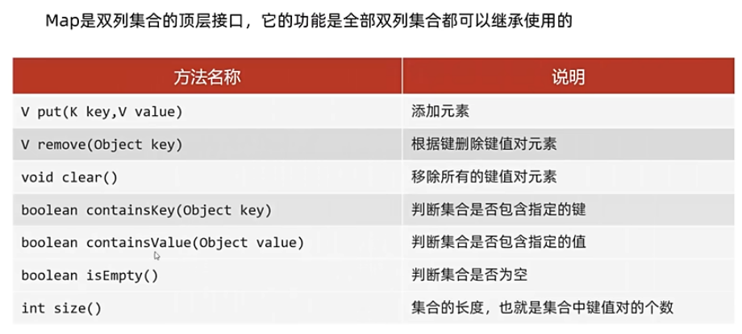
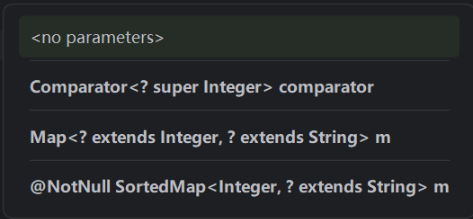

# 双列集合的特点
1. 双列集合一次需要存一对数据，分别是键和值
2. 键不能重复，值可以重复
3. 键和值是一一对应的，每一个值只能找到自己对应的值
4. 键+值这个整体成为“键值对”或者“键值对对象”，**Entry对象**
## Map常见API

put方法返回值：
- 如果添加的键已存在，则返回被覆盖的值（原本的值）
- 如果添加的键不存在，返回null
remove返回值：根据键，返回被删除的值
## Map三种遍历方式
- 键找值
```java
public class mapdemo2 {
    public static void main(String[] args) {
       Map<String,String> m=new HashMap<>();
        m.put("佟毓婉","周庭琛");
        m.put("林周京","韩书俊");
        m.put("果郡王","嬛嬛");

        Set<String> keys = m.keySet();
        //增强for循环方式遍历
        System.out.println("=======增强for循环=======");
        for (String key : keys) {
            System.out.println(key);
            String value = m.get(key);
            System.out.println(key+"="+value);
        }
        //迭代器方式遍历
        System.out.println("=======迭代器=======");
        Iterator<String> it=keys.iterator();
        while(it.hasNext()){
            String key=it.next();
            String value = m.get(key);
            System.out.println(key+"="+ value);
        }
        //Lambda表达式方式遍历
        System.out.println("=======Lambda表达式=======");
        keys.forEach( s ->{
                String value = m.get(s);
                System.out.println(s+"="+value);
        });

    }
}

```
- 键值对
```java
public class mapdemo3 {
    public static void main(String[] args) {
        Map<String,String> m=new HashMap<>();
        m.put("牧首","艾因");
        m.put("星之提督","路辰");
        m.put("执行官","罗夏");

        //键值对遍历方式
        //3.1通过entryset方法获取键值对集合
        Set<Map.Entry<String, String>> entries = m.entrySet();
        //3.2遍历entries集合，去得到里面的每一个键值对对象
        //增强for循环方式遍历
        System.out.println("=======增强for循环=======");
        for(Map.Entry<String, String>entry:entries){
            String key = entry.getKey();
            String value = entry.getValue();
            System.out.println(key+"="+value);
        }
        //迭代器方式遍历
        System.out.println("=======迭代器=======");
        Iterator<Map.Entry<String, String>> it= entries.iterator();
        while(it.hasNext()){
            Map.Entry<String, String> entry = it.next();
            String key = entry.getKey();
            String value = entry.getValue();
            System.out.println(key+"="+value);
        }
        //Lambda表达式方式遍历
        System.out.println("=======Lambda表达式=======");
        entries.forEach( entry-> {
                String  key = entry.getKey();
                String value = entry.getValue();
                System.out.println(key+"="+value);

        });
    }
}
```
- Lambda表达式
```
default void forEach(Biconsumer<? super K,? super V> action)
```
代码实例
```java
public class mymap4 {
    public static void main(String[] args) {
        Map<String, String> m=new HashMap<>();
        m.put("曹操","不可能绝对不可能");
        m.put("刘备","接着奏乐接着舞");
        m.put("狼因","开花结果你还记得吗");
        //底层：
        //foreach方法就是利用增强for方式进行遍历，一次的到每一个键和值
        //m.forEach(( key,  value)-> System.out.println(key+"="+value ));
        m.forEach(new BiConsumer<String, String>() {
            @Override
            public void accept(String key, String value) {
                System.out.println(key+"="+value);
            }
        });

    }
```
## HashMap
### HashMap特点
1. HashMap是Map的一个实现类
2. 没有需要额外学习的特有方法，直接实现Map里面的方法即可
3. 特点都是由键决定的：**无序**，不重复，无索引
4. HashMap跟HashSet底层原理都是哈希表结构 
### HashMap底层原理
  put方法存一个entry对象。根据键计算哈希值，决定存入的位置。如果位置上已有一个对象，用equals方法比较键的值。如果相同，则**覆盖**；如果不同，挂在下面，形成链表。（jdk8之后如此，jdk8之前是新添加元素存入，原对象接在下面链表）<br>jdk8之后，链表长度超过8 &数组长度>=64，自动转成红黑树。
## LinkedHashMap
### 特点
- 由键决定：**有序**，不重复，无索引
- 有序：从存储和取出的顺序一致 
- 原理：底层依旧是哈希表，只是每个键值对元素有额外多了一个双链表的机制记录存储的顺序
## TreeMap
- TreeMap跟TreeSet底层原理一样，都是红黑树结构
- 由键决定特性：不重复，无索引，可排序
- 可排序：对键进行排序
**注：**默认按照键从小到大进行排序，也可以自己规定键的排序规则
### 代码书写两种排序规则
- 实现Comparable接口，指定比较规则
```java
TreeMap<K,V> m=new TreeMap<>(/*在这里ctrl+p*/);
```

- 创建集合时传递Comparator比较器对象，指定比较规则。
