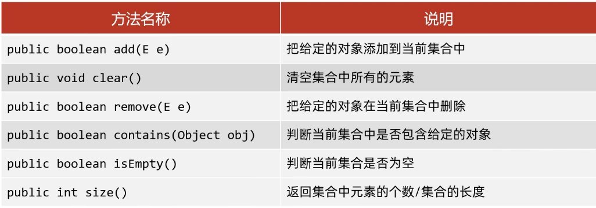
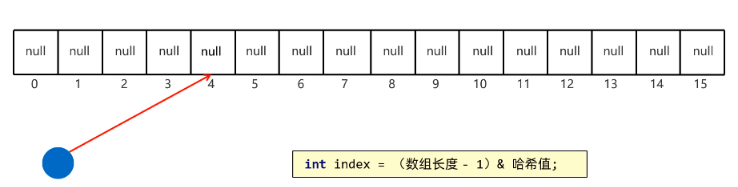
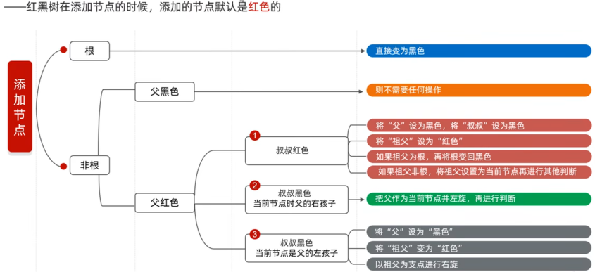

# Set系列集合
- 无序：存和取的顺序不一样
- 不重复：可以去除重复
- 无索引：没有带索引的方法，不可使用普通的佛如循环遍历，也不能通过索引来获取元素
# Set集合的实现类
- HashSet：无序，不重复，无索引
- LinkedHashSet：**有序**，不重复，无索引，有序
- TresSet：**可排序**，不重复，无索引

**Set接口中的方法基本上与Collection的API一致**

回顾Collection常见方法： 
```java
//Set 是接口，HashSet 是实现类
        //1.创建一个Set集合对象
        Set<String> s=new HashSet<>();
        //2.添加元素
        //初次添加，add方法返回true
        //重复添加，添加失败，add方法返回false
        s.add("张三");
        s.add("张三");
        s.add("李四");
        s.add("王五");
        //3.打印集合对象
        //输出无序无重复
        System.out.println(s);//[李四, 张三, 王五]
        //迭代器遍历
        Iterator<String> it=s.iterator();
        while(it.hasNext()){
            String str=it.next();
            System.out.println(str);
        }
        //Lambda表达式遍历
        s.forEach(System.out::println);//方法引用
```
## HashSet底层原理
- HashSet集合底层采取哈希表存储数据
- 哈希表是一种对于增删改查数据性能都较好的结构
### 哈希表的组成
- JDK8之前：数组＋链表
- JDK8之后：数组+链表+红黑树
### 哈希值：对象的整数表达形式
- 根据hashCode方法算出来的interesting类型的整数
- 该方法定义在object类中，所有的对象都可以调用，默认使用地址值进行计算
- 一般情况下，会重写hashCode方法，利用对象内部的属性值计算哈希值

### 对象的哈希值特点
- 如果没有重写hashCode方法，不同对象计算出的哈希值是不同的
- 如果已经重写hashCode方法，不同的对象只要属性值相同，计算出来的哈希值就是一样的
- 在小部分的情况下，不同的属性值或者不同的地址值计算出来的哈希值也有可能是一样的（哈希碰撞）。
### HashSet JDK8之前的底层原理
1. 创建于一个默认长度为16，默认加载因子0.75的数组，数组名table
``` 
HashSet<String> hm=new HashSet<>();
```
2. 根据元素的哈希值跟数组的长度计算出应存入的位置
```
int index =(数组长度-1)&哈希值；
```
3. 判断位置是否为NULL，如果是null，直接存入
4. 如果位置不为null，表示有元素，则调用equals方法比较属性值
5. 一样：不存<br> 不一样：存入数组，形成链表
```
JDK8之前：新元素存入数组，老元素挂在新元素下面
JDK8之后：新元素直接挂在老元素下面
```
**JDK8之后，当链表长度超过8，并且 数组长度大于等于64时，自动转换成红黑树**
**如果集合里存储的是自定义对象，必须重写hashCode和equals方法**
## LinkedHashSet 底层原理
- **有序**（存和取顺序一致），不重复，无索引
- **原理**：底层依然是哈希表，只是每个元素有额外的多了一个双链表的机制记录存储的顺序。
## TreeSet
- 不重复，无索引，**可排序**
- 可排序：按照和元素的默认规则（由小到大）排序
- TreeSet集合底层是基于**红黑树的数据结构**实现排序的，增删改查性能都较好。
### TreeSet集合默认的规则
- 对于数值类型：Integer,Double，默认按照从小到大的顺序进行排序。
- 对于字符，字符串类型：按照字符在ASCII码表中的数字升序进行排序
- 对于自定义类，要实现Comparable接口
### TreeSet的两种比较方式
- 方法一：默认排序/自然排序：JavaBean类实现 Comparable接口指定比较规则
- 方法二：比较器排序：创建TreeSet对象的时候，传递比较器Comparator制定规则
**使用规则：默认使用第一种，如果第一种并不能满足当前需求，就使用第二种**
**红黑树添加规则**
