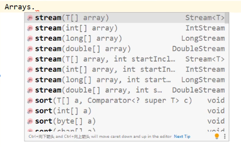
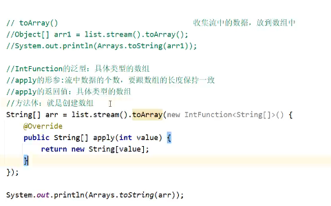
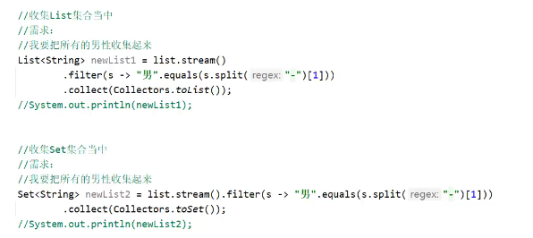
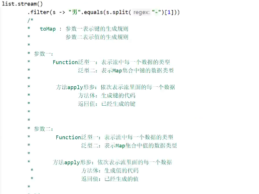
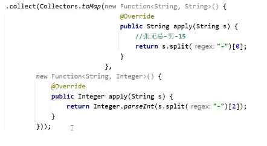

# Stream流

## 使用步骤

1. ### 得到stream流，放数据

   | 获取方式     | 方法名                                     | 说明                     |
   | ------------ | :----------------------------------------- | ------------------------ |
   | 单利集合     | default Stream<E>stream()                  | Collections的默认方法    |
   | 双列集合     | 无                                         | 无法直接使用stream流     |
   | 数组         | public static<T>Stream<T>stream(T[] array) | Arrays工具类中的静态方法 |
   | 一堆零散数据 | public static <T>Stream<T> of(T...values)  | Stream接口中的静态方法   |

   - #### 单列集合

     ```java
     ArrayList<String> list=new ArrayList<>();
             Collections.addAll(list,"a","b","c","d","e");
             /*Stream<String> stream1=list.stream();
             stream1.forEach(new Consumer<String>() {
                 @Override
                 public void accept(String s) {
     *//*                s:依次表示流水线上的每一数据*//*
                     System.out.println(s);
                 }
             });*/
             list.stream().forEach(s-> System.out.println(s));
     ```

     

   - #### 双列集合

     ```java
     HashMao<String,Integer> hm=new HashMap<>();
     hm.put("aaa",111);
     hm.put("bbb",222);
     hm.put("ccc",333);
     hm.put("ddd",444);
     //1.keySet
     hm.keySet().stream().forEach(s->System.out.println(s));
     //2.entrySet
     hm.entrySet().stream().forEach(s->System.out.println(s));
     ```

     

   - #### 数组

     ```java
     int [] arr={1,2,3,4,5,6,7,8,9};
     String [] arr2={"a","b","c"};
     Arrays.stream(arr1).forEach(s->sSystem.out.println(s));
     Arrays.stream(arr2).forEach(s->sSystem.out.println(s));
     
     
     ```

     

   - #### 一堆零散数据

     ```java
     Stream.of(1,2,3,4,5).forEach(s->System.out.prinntln(s));
     ```

   ***注意：Stream接口中的静态方法Of：方法的形参是一个可变参数，客串第一对零散的数据，也可以传递数组，但是数组必须是引用数据类型。***

   ***如果传递基本数据类型，会把整个数据当一个元素，放到Stream当中。***

   

2. ### 使用中间方法数据操作

   | 名称                                           | 说明                               |
   | ---------------------------------------------- | ---------------------------------- |
   | Stream<T> filter(Predicate<?superT> predicate) | 过滤                               |
   | Stream<T>  limit(long maxSize)                 | 获取前几个元素                     |
   | Stream<T> skip(long n)                         | 跳过前几个元素                     |
   | Stream<T>  distinct()                          | 元素去重，依赖hashcode和equals方法 |
   | static <T> Stream<T> concat(Stream a,Stream b) | 合并a和b两个流为一个流             |
   | Stream<R> map (Function<T,R> mapper)           | 转换流中的数据                     |

   ***注意：***

   1.修改Stream流中的数据，不会影响原来集合或者数组中的数据

   2.中间方法返回新的Stream流，不会影响原来集合或者数组中的数据

   ```java
   ArrayList<String> list=new ArrayList<>();
   Collections.addAll(list,"");
   
   //filter
   list.stream().filter(s-> s.startwith("zhang")
                        .filter(s->s.length()>=3)
                        .forEach(s-> System.out.println(s));
   //limit    获取前n个（个数）
   list.stream().limit(3);
   //skip   跳过前n个元素
   list.stream().skip(3);
   //distinct  去重，（利用hashcode()和equals（）方法）
   list.stream().distinct().forEach(s-> System.out.println(s));    
    //concat  合并两个流，（类型要相同）
   Stream().concat(list1.stream(),list2.stream()).forEach(s-> System.out.println(s)); 
   //map 数据类型转换
   Collections.addAll("张无忌-13");
    //s:依次表示流里的每一个数据
                        
                        
   list.stream().map(new Function<String.Integer>(){
       @Override
       public Integer apply(String s){
           String[] arr=s.split("-");
           String ageString =arr[1];
           int age=Integer.parseInt(ageString);
           return age;
       }
   }).forEach(s-> System.out.println(s));
   
   
   
   
   ```

   

3. ### 使用终结方法对流水线上的数据进行操作

|             名称              |                 说明                 |
| :---------------------------: | :----------------------------------: |
| void forEach(Consumer action) |                 遍历                 |
|         long count()          |                 统计                 |
|           toArray()           | 收集流中的数据放到数组中，空参和带参 |
| collect(Collector collector)  |      收集流中的数据，放到集合中      |



### collect

- 放在List和Set集合中
- Map集合:list.stream().collect(Collectors.toMap(键规则，值规则))；


- 

.startwith("")


