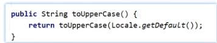

# 方法引用

## `把已有的方法拿过来用，当作函数式接口中抽象方法的实体类`

1. 引用出必须是函数式接口
2. 被引用的方法必须已经存在
3. 被引用方法的形参和返回值必须要和抽象方法保持一致
4. 被引用方法的功能要满足当前要求

**被引用的方法可以是Java写好的，也可使第三方的工具类**

## 使用

```java
public class FunctionDemo1{
    public static void main(String args[]){
        Integer[] arr={3,6,2,8,4};
        //匿名内部类
        Arrays.sort(arr,new Comparator<Integer>(){
            @Override
            public int compare(Integer o1,Integer o1){
                return o2-o1;
            }
        });
        
        //lambda表达式
        Arrays.sort(arr,( o1,o2)->  o2-o1);
        //方法引用
        Arrays.sort(arr,FunctionDemo1::sunbstraction);
        
    }
    
    public static int substraction(int num1,int num2){
        return num2-num1;
    }
}
```

## 分类

1. ### 引用静态方法

   **格式**：类名：：静态方法

   **范例**：Integer::

   ```java
   import 
   public class FunctionDemo1{
       public static void main(String args[]){
        ArrayList<String> list=new ArrayList<>();
        Collections.addAll(list,"1","2","3","4","5","6");
           //变成int类型
        list.stream().map(new Function<String,Integer>(){
               @Override
               public Integer apply(String s){
                   int i=Integer.parseInt(s);
                   return i;
               }
           }).forEach(s-> System.out.println(s));
           /*
           Integer中：
           public static int parseInt(String s) throws NumberFormatException{
           return parseInt(s,10);
           }*/
           //方法
           list.stream().map(Integer::parseInt).forEach(s-> System.out.println(s)); 
       }
   }
   ```

   

2. ### 引用成员方法

   **格式：对象：：成员方法**

   - 其他类的成员方法：其它类对象(其他类)：：方法名
   - 本类的成员方法:  this::方法名(static则new)
   - 父类的成员方法：super::方法名

   ```java
   public class FunctionDemo1 {
       public static void main(String[] args) {
           //1.创建集合
           ArrayList<String> list=new ArrayList<>();
           //2.添加元素
           Collections.addAll(list,"张三","张文轩","张强","钟敏");
           //3.过滤数据
   //        list.stream()
           //.filter(s->s.startsWith("张"))
           //.filter(s->s.length()>=3)
           //.forEach(System.out::println);
           
           
           //匿名内部类
          /* list.stream().filter(new Predicate<String>() {
               @Override
               public boolean test(String s) {
                   return s.startsWith("张")&&s.length()>=3;
               }
           }).forEach(System.out::println);*/
   
   
   
           //方法引用   普通成员方法：     对象：：方法名
           list.stream().filter(new StringOperation()::stringJudge).forEach(System.out::println);
   
       }
   }
   ```

   注意：**静态方法中无  this，super**

   ```java
   package com.dragonfly;
   
   import java.util.ArrayList;
   import java.util.Collections;
   import java.util.function.Predicate;
   
   /**
    * 描述：方法引用
    *
    * @param
    * @author 蜻蜓大王
    * @date 2026/3/11 21:58
    */
   public class FunctionDemo1 {
       public static void main(String[] args) {
           //1.创建集合
           ArrayList<String> list=new ArrayList<>();
           //2.添加元素
           Collections.addAll(list,"张三","张文轩","张强","钟敏");
           //3.过滤数据
   //        list.stream().filter(s->s.startsWith("张")).filter(s-> s.length()>=3).forEach(System.out::println);
          /* list.stream().filter(new Predicate<String>() {
               @Override
               public boolean test(String s) {
                   return s.startsWith("张")&&s.length()>=3;
               }
           }).forEach(System.out::println);*/
   
   
   
           //方法引用   普通成员方法：     对象：：方法名
   //        list.stream().filter(new StringOperation()::stringJudge).forEach(System.out::println);
           //本类成员方法：     this：：方法名
           list.stream().filter(new FunctionDemo1()::stringJudge)
                   .forEach(System.out::println);
       }
       public boolean stringJudge(String s){
           return s.startsWith("张")&&s.length()>=3;
       }
   }
   
   ```

   ```java
   ```

   

3. ### 引用构造方法

   **格式：**  类名：： new

   **范例：** Student:: new

   ```java
   /*
       Collections.addAll(list,"zhang-14","jiushi-13","hunan-17","jiksfn-96","kkk-9",)
       list.stream().map(new Function<String.Integer>(){
       @Override
       public Integer apply(String s){
           String[] arr=s.split("-");
           String name =arr[0];
           int age=arr[1]
           int age=Integer.parseInt(ageString);
           return new Student(name,age);
       }
   }).forEach(s-> System.out.println(s));*/
   /*1. 引用出必须是函数式接口
   2. 被引用的方法必须已经存在
           3. 被引用方法的形参和返回值必须要和抽象方法保持一致
   4. 被引用方法的功能要满足当前要求*/
   list.stream().map(Student::new).forEach(s-> System.out.println(s));
   ```

   

4. ### 其他调用方式

   ```
   1. 引用出必须是函数式接口
   2. 被引用的方法必须已经存在
   3. 被引用方法的形参需要和抽象方法的第二个形参到最后一个形参保持一致，返回值必须要保持一致
   4. 被引用方法的功能要满足当前要求
   抽象方法形参的详解：
   
   **第一个参数**： 表示被引用方法的调用者，决定了可以引用那些类的方法
              在stream流中，第一个参数一般都表示流里的每一个数据
              假设流里面的数据都是字符串，那么使用这种方式进行方法引用，            只能引用String这个类中的方法。
   第二个参数到最后一个参数：跟被引用方法的形参保持一致，如果没有第二个参数，说明被引用的方法现需要无参数的成员方法。
   
   ```

   

   - 使用类名引用成员方法

     **格式：**类名：：成员方法

     **范例：** String :: substring

     ```java
     list.stream().map(new Function<String,String>(){
         @Override
         //第一个参数String
         public String apply(String s){
             return toUpperCase();
         }
     }).forEach(s->System.out.println(s));
     list.stream().map(String::toUpperCase).forEach(s->System.out.println(s));
     ```

     

   - 引用数组的构造方法

     **格式：** 数据类型[]：：new

     **范例：** int[]  :: new

     注意：：  数组的类型必须和流中的数据类型保持一致